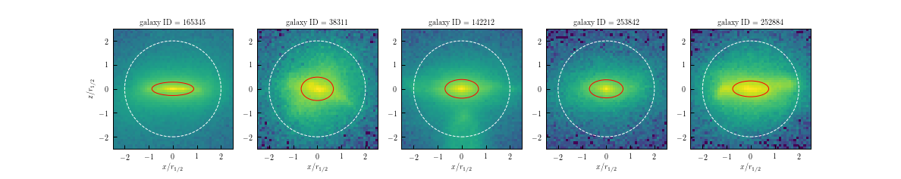

# Illustris Galaxy Shapes

This is a project to measure galaxy and halo shapes/orientations in the Illustris Simulations.


*Figure: Five example galaxies from Illustris-1.  The stellar density has been projected along the intermediate axis, shown using a log-scale. The primary axis has been aligned with the x-axis, the minor with the y-axis, and the scale normalized by the stellar half-mass radius.  The white dotted circle indicates twice the stellar half-mass radius.  The projection of the 3-D ellipsoid determined using the iterative reduced inertia tensor is shown as a red ellipse.*

## Requirements

This project requires the following Python packages installed:

* [numpy](http://www.numpy.org)
* [astropy](http://www.astropy.org)
* [inertia_tensors](https://github.com/duncandc/inertia_tensors/edit/master/README.md)
* [illustris_python](https://bitbucket.org/illustris/illustris_python)

Currently, I calculate galaxy and halo shapes for the following simulations:

* Illustris-1
	* z=0.0 (snapshot 135)
	* z=0.6 (snapshot 099)
	* z=1.0 (snapshot 085)
* Illustris-1-Dark
	* z=0.0 (snapshot 135)
	* z=0.6 (snapshot 099)
	* z=1.0 (snapshot 085)
* TNG300-1
	* z=0.0 (snapshot 099)
* TNG300-1-Dark
	* z=0.0 (snapshot 099)
* TNG100-1
	* z=0.0 (snapshot 099)
* TNG100-1-Dark
	* z=0.0 (snapshot 099)


## Galaxy & Halo Shapes

Galaxy shapes are calculated for galaxies with a stellar mass within two times the stellar half-mass radius of at least log(Mstar)>= 9 + log(h), using all stellar particles (excluding wind particles) that are within two times the stellar half-mass radius.  The center of a galaxy is taken to be the most bound particle within the subfind subhalo, regardless of particle type.

(Sub-)halo shapes are calculated using all dark matter particles that belong to a subfind 'subhalo' with at least 1000 particles.  The center of (sub-)haloes is taken to be the most bound particle in the subfind subhalo, regardless of particle type.  Note that subfind sub-haloes exclude particles that belong to substructures, i.e. central subhaloes do not include particles from satellite subhaloes.  

Galaxy and halo shapes/orientations are calculated using the following scripts:

* `calculate_galaxy_shapes.py`
* `calculate_halo_shapes.py`

Each of these scripts can be run to create a shape catalog for a given simulation, snapshot, and shape calculation method.  For example, to calculate galaxy shapes for the Illustris-1 simulation at z=0 (snapshot 135) using the reduced inertia tensor method, you would execute the following command:

```
$user: python calculate_galaxy_shapes.py Illustris-1 135 reduced
```

The resulting shape catalogs are saved in the `./data/shape_catalogs/` directory.

All galaxy and halo shapes are determined by calculating an inertia tensor for a particle distribution.  The code to calculate inertia tensors is part of the [inertia_tensors](https://github.com/duncandc/inertia_tensors/edit/master/README.md) package.  There are three methods implemented: non-reduced, reduced, and iterative.  See the docs in the [inertia_tensors](https://github.com/duncandc/inertia_tensors/edit/master/README.md) package for details on how these quantities are calculated.

Note that in order to run these scripts, you must have the required particle data downloaded on to your disk.  The location of this data for each simulation is set in the `simulation_props.py` file as the `basePath` key in each dictionary.  Scripts to download particle data are stored in the `./data/` directory.


## Galaxy Circularity

For each sample for which galaxy shapes are calculated, I also calculate the specific angular momentum and circularity for galaxies.  This is calcuated using:

*  `calculate_galaxy_circularity.py`

Similarly to the shape caclulations, to calculate circularity properties for the Illustris-1 simulation at z=0 (snapshot 135) using particles within 10 times the stellar half-mass radius, you would execute the following command:

```
$user: python calculate_galaxy_circularity.py Illustris-1 135 10.0
```

The resulting circularity catalogs are saved in the `./data/shape_catalogs/` directory.  
  
The specific angular momentum for galaxies is calculated using all star particles (excluding wind particles) within two times the stellar half-mass radius.  Again, the center of a galaxy is taken to be the most bound particle within the subfind subhalo, regardless of particle type.  The magnitude and direction of the specific angular momentum for each galaxy is recorded.

In addition, the circularity is calculated for each stellar particle within a galaxy (within the specified radius).  See [Scannapieco et al. (2009)](https://arxiv.org/abs/0812.0976) for details of the calculation.  Briefly, for each star particle within a galaxy, the specific angular momentum is compared to that of a particle on a circular orbit aligned with the total angular momentum vector of the stellar component of the galaxy--the ratio is the circularlity.  Particles with high circularity (e>0.7) are considered disk stars, although this threshold is somewhat arbitrary.  The fraction of stellar mass that passes this threshold is recorded as the 'disk fraction'.  


## Halo Catalogs

Illustris provides "full physics" and dark matter only (DMO) versions of all the available simulations.  This project uses both full physics and DMO simulations.  Halo catalogs are built for the DMO simualtions using the `make_halo_catalog.py` script.  This script builds a simple, value added, flat formatted catalog of halo properties. 

```
$user: python match_haloes.py Illustris-1-Dark 135
```   

Illustris proivides mathcing between (sub-)haloes in full physics and DMO runs for a subset of simulations, described [here](http://www.illustris-project.org/data/docs/specifications/#sec4d).  Since this project only requires host halo matching, we preform this matching ourselves for all simulations using the `match_haloes.py` script.  This script finds the nearest neighbor to each host halo in a full phjysics run into a DMO run.  The location of the halo is taken to be the location of the most bound particle, `GroupPos`, in the parlance of the Illustris [group catalogs](http://www.illustris-project.org/data/docs/specifications/#sec2a).  For example, to find matches between Illustris-1 and Illustris-1-Dark z=0 catalogs:

```
$user: python match_haloes.py Illustris-1 135
```    

Note that to run these scripts, you must have the "groupcat" files downloaded for the requested snapshot from the Illustris data access page.


## Data

This project uses a large amount of particle data (multiple Tb) available on the Illustris data access webpage.  Scripts to efficiently download the required data are available in the `./data` directory.

The data products created by this project are stored in the `./data` directory. 

contact:
duncanc@andrew.cmu.edu
