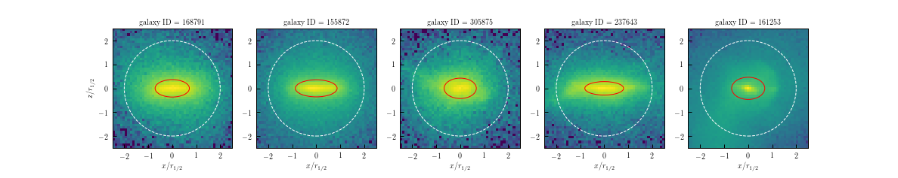

# Illustris Galaxy Shapes

This is a project to measure galaxy and halo shapes/orientations in the Illustris Simulations.



## Requirements

This project requires the following Python packages installed:

* [numpy](http://www.numpy.org)
* [astropy](http://www.astropy.org)
* [inertia_tensors](https://github.com/duncandc/inertia_tensors/edit/master/README.md)
* [illustris_python](https://bitbucket.org/illustris/illustris_python)


## Galaxy & Halo Shapes

Currently, I calculate galaxy and halo shapes for the following simulations:

* Illustris-1
	* z=0.0 (snapshot 135)
	* z=0.6 (snapshot 099)
	* z=1.0 (snapshot 085)
* Illustris-1-Dark
	* z=0.0 (snapshot 135)
	* z=0.6 (snapshot 099)
	* z=1.0 (snapshot 085)

Galaxy shapes are calculated for galaixes with a stellar mass within two times the stellar half mass radius of at least log(Mstar)>= 9 + log(h), using all stellar particles (excluding wind particles) that are within two times the stellar half mass radius.  The center of galaxies is taken to be the most bound particle in the subfind subhalo, regardless of particle type.

(Sub-)halo shapes are calculated using all dark matter particles that belong to a subfind 'subhalo' with at least 1000 particles.  The center of (sub-)haloes is taken to be the most bound particle in the subfind subhalo, regardless of particle type.  Note that subfind sub-haloes exclude particles that belong to substructures, i.e. central subhaloes do not incluide particles from satellite subhaloes.  

Galaxy and halo shapes/orientations are calculated using the following scripts:

* `calculate_galaxy_shapes.py`
* `calculate_halo_shapes.py`

Each of these scripts can be run to create a shape catalog for a given simulation, snapshot, and shape calculation method.  For example, to calculate galaxy shapes for the Illustris-1 simulation at z=0 (snapshot 135) using the reduced inertia tensor method, you would execute the following command:

```
$user: python calculate_galaxy_shapes.py Illustris-1 135 reduced
```

The resulting shape catalogs are saved in the `./data/shape_catalogs/` directory.

All galaxy and halo shapes are determined by calculating an inertia tensor for a particle distribution.  The code to calculate inertia tensors is part of the [inertia_tensors](https://github.com/duncandc/inertia_tensors/edit/master/README.md) package.  There are three methods implemented: non-reduced, reduced, and iterative.  See the docs in the [inertia_tensors](https://github.com/duncandc/inertia_tensors/edit/master/README.md) package for details on how these quantities are calculated.

Note that in order to run these scripts, you must have the required particle data downloaded on to your disk.  The location of this data for each simulation is set in the `simulation_props.py` file as the `basePath` key in each dictionary.  Scripts to download particle data are stored in the `./data/` directory.


## Data

This project uses a large amount of particle data available on the Illustris data access webpage.  Scripts to effeciently download the required data are availabel in the `./data` directory.

The data products created by this project are stored in the `./data` directory. 

contact:
duncanc@andrew.cmu.edu
